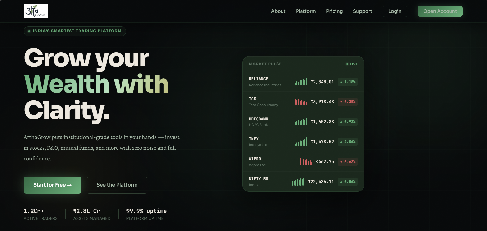
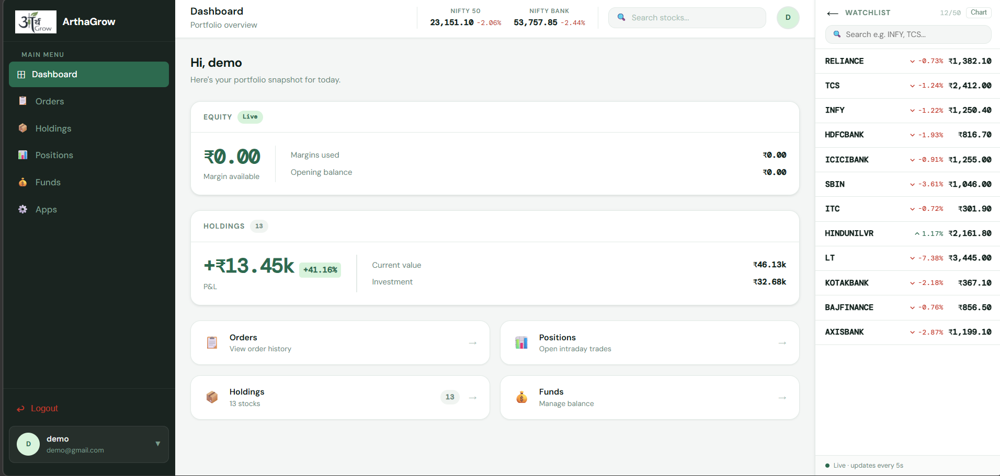
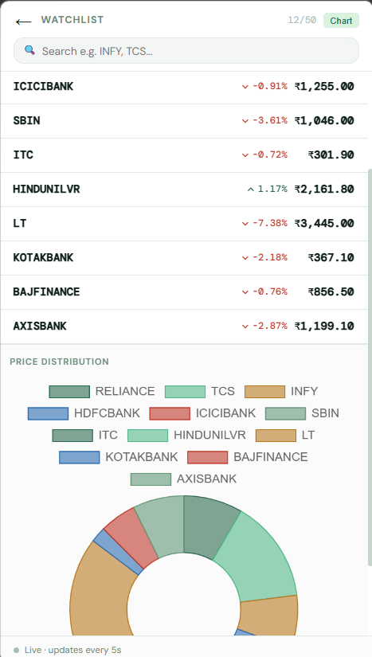
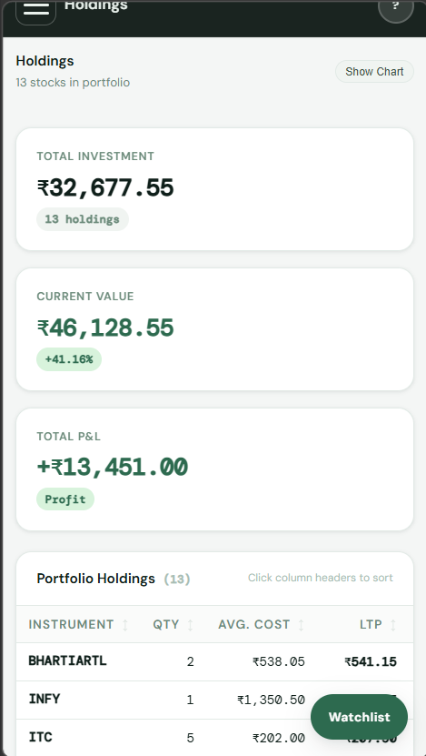

<div align="center">


# ArthaGrow

### India's Modern Stock Trading Platform

A full-stack MERN application for equity trading with real-time NSE market data, portfolio management, and a beautifully designed trading dashboard.

[](https://arthagrow.vercel.app)
[](https://arthagrow-dashboard.vercel.app)
[](https://arthagrow.onrender.com)
[](LICENSE)

</div>

---

## Table of Contents

- [Overview](#overview)
- [Features](#features)
- [Tech Stack](#tech-stack)
- [Project Structure](#project-structure)
- [Getting Started](#getting-started)
- [Environment Variables](#environment-variables)
- [Deployment](#deployment)
- [API Reference](#api-reference)
- [Screenshots](#screenshots)

---

## Overview

ArthaGrow is a full-stack stock trading platform built for Indian retail investors. It provides live NSE market data via WebSockets, a complete portfolio management system, order placement, holdings tracking, and a polished trading dashboard — all accessible through a modern, mobile-responsive interface.

The application is split into three independently deployable services:

| Service | Description | Port |
|---|---|---|
| **Frontend** | Public landing pages, auth, marketing | `3000` |
| **Dashboard** | Trading interface, watchlist, portfolio | `3001` |
| **Backend** | REST API + WebSocket server | `3002` |

---

## Features

### Trading Dashboard
- 📊 **Live Watchlist** — Real-time NSE stock prices via Socket.io, updated every 5 seconds
- 📈 **Live Indices** — NIFTY 50 and NIFTY BANK indices updated every 10 seconds
- 🛒 **Buy / Sell Orders** — Place market and limit orders with keyboard shortcuts (Enter / Escape)
- 💼 **Portfolio Holdings** — Track average cost, current value, and P&L per holding
- 📋 **Order History** — Full order log with BUY/SELL filters and total values
- 📉 **Positions** — Open positions with win rate and overall P&L
- 💰 **Funds Management** — Add/withdraw funds with UPI, margin utilisation tracker
- 🔍 **P&L Chart** — Interactive bar chart showing profit/loss per holding

### Platform
- 🔐 **Cookie-based JWT Auth** — Secure httpOnly-compatible token with `sameSite: none` for cross-origin production
- 📱 **Fully Responsive** — Mobile-first dashboard with slide-in sidebar, full-screen watchlist, and bottom sheet buy/sell
- 🌐 **Public Landing Site** — Home, About, Products, Pricing, Support pages with scroll animations
- 🔒 **Protected Routes** — Server-side session verification on every dashboard load

---

## Tech Stack

### Frontend & Dashboard
| Technology | Purpose |
|---|---|
| React 18 | UI framework |
| React Router v6 | Client-side routing |
| Axios | HTTP client |
| Socket.io Client | Real-time WebSocket connection |
| Chart.js + react-chartjs-2 | Holdings P&L chart |
| Chart.js (Doughnut) | Watchlist price distribution |
| React Toastify | Toast notifications |

### Backend
| Technology | Purpose |
|---|---|
| Node.js + Express | REST API server |
| Socket.io | WebSocket server for live data |
| MongoDB + Mongoose | Database |
| JWT (jsonwebtoken) | Authentication tokens |
| bcrypt | Password hashing |
| cookie-parser | Cookie handling |
| stock-nse-india | NSE market data |
| cors | Cross-origin request handling |

---

## Project Structure

```
ArthaGrow/
│
├── frontend/                   # Public landing site (React)
│   ├── public/
│   │   └── media/images/       # Logo and static assets
│   └── src/
│       ├── index.css           # Design system (dark fintech theme)
│       └── landing_page/
│           ├── Navbar.js       # Responsive navbar with auth state
│           ├── Footer.js
│           ├── home/           # HomePage, Hero, Pricing, Stats, Education
│           ├── about/          # About, Team, Timeline, Press
│           ├── products/       # Platform sections, Universe
│           ├── pricing/        # Brokerage calculator, comparison table
│           ├── support/        # FAQ, Create ticket
│           ├── login/          # Login form
│           └── signup/         # Signup form with password strength
│
├── dashboard/                  # Trading dashboard (React)
│   └── src/
│       ├── config.js           # Centralised URL config
│       ├── index.css           # Dashboard design system (light theme)
│       ├── utils/
│       │   └── ProtectedRoute.js
│       └── components/
│           ├── Home.js         # Layout shell, sidebar + watchlist state
│           ├── TopBar.js       # Live indices, search, user avatar
│           ├── Menu.js         # Sidebar navigation
│           ├── Dashboard.js    # Summary page
│           ├── Summary.js      # Portfolio snapshot, equity section
│           ├── WatchList.js    # Live stock watchlist with search + chart
│           ├── Orders.js       # Order history
│           ├── Holdings.js     # Portfolio holdings with P&L chart
│           ├── Positions.js    # Open positions
│           ├── Funds.js        # Funds management
│           ├── BuyActionWindow.js
│           ├── SellActionWindow.js
│           └── GeneralContext.js
│
└── backend/                    # Express API + WebSocket server
    ├── index.js                # Main server, CORS, Socket.io, NSE data
    ├── controllers/
    │   └── authController.js   # Signup, Login with cookie strategy
    ├── middlewares/
    │   └── AuthMiddleware.js   # JWT verification
    ├── routes/
    │   ├── AuthRoute.js        # /signup /login /verify /logout
    │   └── FundsRoute.js       # /funds /funds/add /funds/withdraw
    ├── models/                 # Mongoose models
    ├── schemas/                # Mongoose schemas
    └── utils/
        └── SecretToken.js      # JWT token creation
```

---

## Getting Started

### Prerequisites
- Node.js v18+
- MongoDB (local or Atlas)
- npm or yarn

### 1. Clone the repository

```bash
git clone https://github.com/NehaSharma-tech/ArthaGrow.git
cd ArthaGrow
```

### 2. Set up the Backend

```bash
cd backend
npm install
```

Create `backend/.env`:
```env
ATLASDB_URL=mongodb+srv://<user>:<password>@cluster.mongodb.net/arthagrow
TOKEN_KEY=your_jwt_secret_key
FRONTEND_URL=http://localhost:3000
DASHBOARD_URL=http://localhost:3001
PORT=3002
```

Start the backend:
```bash
npm start
```

### 3. Set up the Frontend

```bash
cd frontend
npm install
```

Create `frontend/.env`:
```env
REACT_APP_BACKEND_URL=http://localhost:3002
REACT_APP_DASHBOARD_URL=http://localhost:3001
```

Start the frontend:
```bash
npm start
# Runs on http://localhost:3000
```

### 4. Set up the Dashboard

```bash
cd dashboard
npm install
```

Create `dashboard/.env`:
```env
REACT_APP_BACKEND_URL=http://localhost:3002
REACT_APP_FRONTEND_URL=http://localhost:3000
```

Start the dashboard:
```bash
npm start
# Runs on http://localhost:3001 (uses cross-env PORT=3001)
```

---

## Environment Variables

### Backend (Render)

| Variable | Description | Example |
|---|---|---|
| `ATLASDB_URL` | MongoDB Atlas connection string | `mongodb+srv://...` |
| `TOKEN_KEY` | JWT signing secret | `supersecretkey123` |
| `FRONTEND_URL` | Deployed frontend URL | `https://arthagrow.vercel.app` |
| `DASHBOARD_URL` | Deployed dashboard URL | `https://arthagrow-dashboard.vercel.app` |
| `NODE_ENV` | Environment mode | `production` |
| `PORT` | Server port (set by Render) | `10000` |

### Frontend (Vercel)

| Variable | Description | Example |
|---|---|---|
| `REACT_APP_BACKEND_URL` | Backend API URL | `https://arthagrow.onrender.com` |
| `REACT_APP_DASHBOARD_URL` | Dashboard app URL | `https://arthagrow-dashboard.vercel.app` |

### Dashboard (Vercel)

| Variable | Description | Example |
|---|---|---|
| `REACT_APP_BACKEND_URL` | Backend API URL | `https://arthagrow.onrender.com` |
| `REACT_APP_FRONTEND_URL` | Frontend app URL | `https://arthagrow.vercel.app` |

> ⚠️ **Important:** Never commit `.env` files. They are listed in `.gitignore`. Set all production variables through Vercel's dashboard (Settings → Environment Variables) and Render's Environment tab.

---

## Deployment

### Architecture

```
User Browser
     │
     ├──► Vercel (Frontend)   https://arthagrow.vercel.app
     │         │ redirects to dashboard after login
     │
     ├──► Vercel (Dashboard)  https://arthagrow-dashboard.vercel.app
     │         │ API calls + WebSocket
     │
     └──► Render (Backend)    https://arthagrow.onrender.com
               │
               └──► MongoDB Atlas
               └──► NSE India API (stock data)
```

### Deploy Backend to Render

1. Connect your GitHub repo to [Render](https://render.com)
2. Set **Root Directory** to `backend`
3. Set **Build Command** to `npm install`
4. Set **Start Command** to `npm start`
5. Add all backend environment variables in the **Environment** tab
6. Set `NODE_ENV=production`

### Deploy Frontend to Vercel

1. Import your GitHub repo to [Vercel](https://vercel.com)
2. Set **Root Directory** to `frontend`
3. Framework preset: **Create React App**
4. Add environment variables in **Settings → Environment Variables**
5. Redeploy after adding variables

### Deploy Dashboard to Vercel

Same as frontend, but:
1. Set **Root Directory** to `dashboard`
2. Add dashboard-specific environment variables

> 💡 **Note:** After updating environment variables on Vercel, you must manually trigger a redeploy — Vercel doesn't rebuild automatically on env var changes.

---

## API Reference

### Auth Routes

| Method | Endpoint | Description | Auth |
|---|---|---|---|
| `POST` | `/signup` | Register new user | ❌ |
| `POST` | `/login` | Login, sets cookie | ❌ |
| `POST` | `/verify` | Verify JWT cookie | ✅ Cookie |
| `GET` | `/logout` | Clear auth cookie | ✅ Cookie |

### Data Routes

| Method | Endpoint | Description | Auth |
|---|---|---|---|
| `GET` | `/holdings` | Get all holdings | ❌ |
| `GET` | `/positions` | Get all positions | ❌ |
| `GET` | `/orders` | Get all orders | ❌ |
| `POST` | `/newOrder` | Place order, update holdings | ❌ |

### Funds Routes

| Method | Endpoint | Description | Auth |
|---|---|---|---|
| `GET` | `/funds` | Get fund details | ✅ Cookie |
| `PATCH` | `/funds/add` | Add funds | ✅ Cookie |
| `PATCH` | `/funds/withdraw` | Withdraw funds | ✅ Cookie |

### WebSocket Events

| Event | Direction | Description |
|---|---|---|
| `watchlistUpdate` | Server → Client | Live prices for 12 watchlist stocks (every 5s) |
| `indicesUpdate` | Server → Client | NIFTY 50 + NIFTY BANK values (every 10s) |
| `connected` | Server → Client | Emitted on successful socket connection |

---

## Known Limitations

- **NSE API on server** — NSE India blocks server-side requests without browser headers. The backend bootstraps a session by visiting nseindia.com on startup and refreshes it every 25 minutes. During market hours, data may occasionally be delayed if the session expires.
- **Render free tier cold starts** — The backend may take 30–50 seconds to respond after inactivity on the free Render plan.
- **Demo data** — Holdings, positions, and orders are shared across all users (no per-user data isolation for market data — only funds are per-user).

---

## Screenshots

### Landing Page


### Trading Dashboard


### Live Watchlist


### Holdings & P&L


---

## Contributing

Pull requests are welcome. For major changes, please open an issue first to discuss what you'd like to change.

1. Fork the repository
2. Create your feature branch (`git checkout -b feature/amazing-feature`)
3. Commit your changes (`git commit -m 'Add amazing feature'`)
4. Push to the branch (`git push origin feature/amazing-feature`)
5. Open a Pull Request


---

<div align="center">

Built with ❤️ by [Neha Sharma](https://github.com/NehaSharma-tech)

</div>